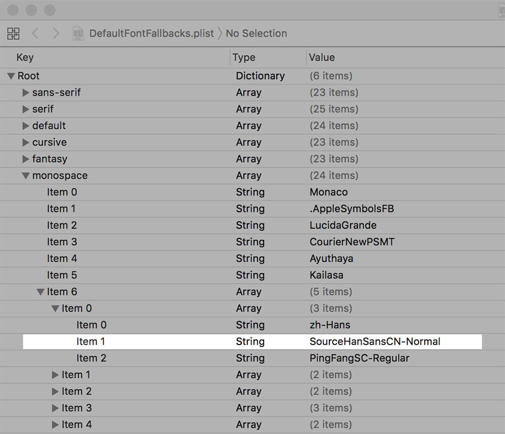

Font Fallbacks
================================================
This is a tutorial on how to change the terminal's default fallback fonts(s) on
variant systems. It was inspired by the [gabrielelana/awesome-terminal-fonts][2]
project.

When displaying a character, the terminal first tries to find its glyph in
current font, and if no glyph is found, it then tries to look up the glyph from
a list of fallback fonts. This process is called the "font fallback mechanism".

Through the use of fallback fonts, it's possible to provide different typefaces
for variant character collections. 

A typical example is: setting "Monaco" as the default font, and
"PingFangSC-Regular" as the fallback font for Simplified Chinese characters.
In this setup, latin characters can be rendered with the nice looking "Monaco"
typeface, while Simplified Chinese characters will be rendered with the
"PingFangSC-Regular" font, which is optimized for CJK characters.

In the example above, if "PingFangSC-Regular" was configured to be the default
font, latin characters will look odd, because they are rendered by the
"PingFangSC-Regular" font instead.

Background
-------------
When creating this tutorial, we have developed a CJK font, based on the
[adobe/source-han-sans][3] project, because we need some Chinese Radicals which
are not encoded in unicode yet. So we added glyphs for the missing radicals in
the base font and use ``IDS`` (Ideographic Description Sequences) and ``ccmp``
(Glyph Composition/Decomposition) feature to pseudo-encode these radicals.

We found the latin characters under the CJK font look very odd in the terminal
window, probabaly due to its variant width and different hint values, so it's
obviously not a good idea to set this font as the default font. Thus, we started
to look for a way to override the default fallback fonts. Fortunately, we found
the [gabrielelana/awesome-terminal-fonts][2] project, which is very helpful.

And in order to keep a note for this trick, we created this tutorial.

Mac OS X
-------------

### Disable System Integrity Protection ###

1. Reboot Mac and hold <kbd>CMD+R</kbd> to enter the recovery mode.
1. Launch terminal and run:
```bash
$ csrutil disable
$ reboot
```

### Backup Plist ###
```bash
$ cd /System/Library/Frameworks/CoreText.Framework/Resources
$ sudo cp DefaultFontFallbacks.plist DefaultFontFallbacks.plist.orig
```

### Edit Plist ###
```bash
$ cd /System/Library/Frameworks/CoreText.Framework/Resources
$ cp DefaultFontFallbacks.plist ~/Desktop
$ cd ~/Desktop
$ open -a xcode.app DefaultFontFallbacks.plist
```

Add the new fallback font in the plist as follows:



::: info-box note

Assume the "SourceHanSansCN-Normal" font has been installed.

:::

### Overwrite Plist ###
```bash
$ cd /System/Library/Frameworks/CoreText.Framework/Resources
$ sudo cp ~/Desktop/DefaultFontFallbacks.plist .
```

### Re-Enable System Integrity Protection ###

Reboot into recovery mode again and re-enable System Integrity Protection:
```bash
$ csrutil enable
$ reboot
```

References
----------
* [The gabrielelana/awesome-terminal-fonts project][2]
* [The adobe/source-han-sans project][3]

[1]:  https://opensource.org/licenses/MIT "The MIT License (MIT)"
[2]:  https://github.com/gabrielelana/awesome-terminal-fonts "The gabrielelana/awesome-terminal-fonts"
[3]:  https://github.com/adobe-fonts/source-han-sans "The adobe/source-han-sans project"

License
-------
This tutorial is published under the [MIT License][1].
